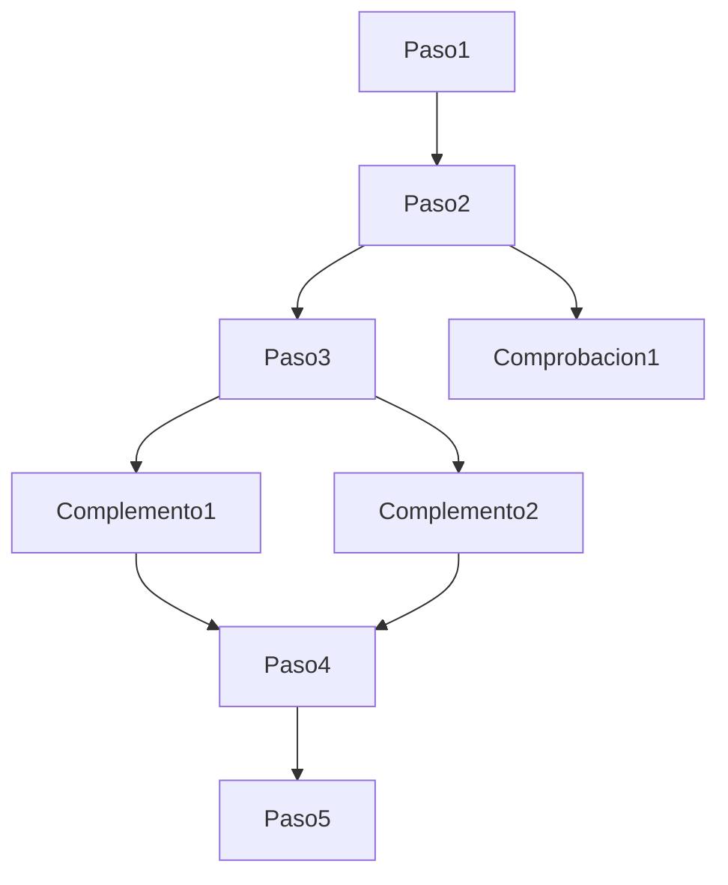

# Boletin 4

## Pasos a seguir

  ***1.*** Realiza un fork del repositorio y corrige los errores. :heavy_check_mark:

***2.*** Los errores **están** en el DTD interno. :x:

 ***3.*** Los ficheros no están formateados (están **mal las tabulaciones**), también corrije este aspecto. :memo:

 Recuerda: 
 >Lorem ipsum dolor sit amet. 

* Ejemplo de superíndice, subíndice y ~~tachado~~.

* [Enlace a W3Schools](https://www.w3schools.com/)
* [Enlace al ejercicio colores.xml](colores.xml)

1. Lista
   - Lista anidada
     - Lista más anidada

Este es un ejemplo de cita de código: usa `git push` para actualizar los cambios en el repositorio remoto.
### Lista de tareas
- [x] Leer apuntes COD
- [ ] Trabajo SI
- [x] Estudiar BBDD

Aquí un ejemplo de nota a pie de página [^1]
[^1]: Nota a pie de página.

<!-- Comentario en Markwdown -->

\*Esto es una línea que ignora el formateo de Markdown\_

Agradecimientos: [@AlejandraDominguezCereijo](https://github.com/AlejandraDominguezCereijo)